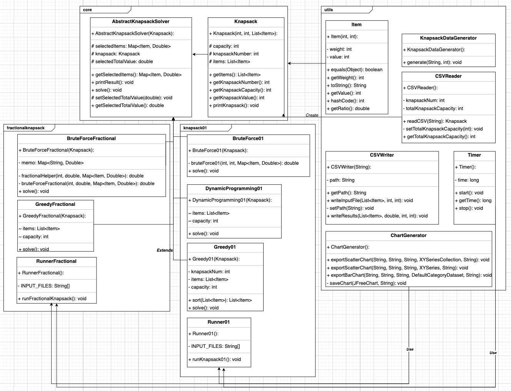

# Java Application: Comparing KnapSacks Experiment


## Project Overview
The Comparing Knapsacks Experiment is a Java-based project aimed at implementing and analyzing different approaches to solving the 0/1 Knapsack Problem and the Fractional Knapsack Problem. The project requires the development of Brute Force, Greedy, and Dynamic Programming algorithms, comparing their execution times and efficiency. The program processes input data from CSV files, executes the algorithms, and generates performance metrics such as execution time and profit. Results are visualized using plot charts to evaluate the effectiveness of each algorithm. Additionally, a final report is required to document the design, results, and theoretical analysis, including comparisons between empirical and theoretical performance. The project follows OOP principles, unit testing, and GitHub version control practices, ensuring a structured and well-documented implementation.

## Features
1. **Implement Multiple Knapsack Algorithms:** Implements Brute Force, Greedy, and Dynamic Programming approaches for Knapsack problems.
2. **Granularity Constraint for Fractional Knapsack:** Ensures fractional selection is limited to increments of 0.1 for accurate performance evaluation.
3. **Process and Analyze Input Data:** Reads input values and weights from CSV files, including custom-generated test cases with item sizes 20, 25, and 30. Enable random input generation by size.
4. **Measure Execution Time and Profit:** Tracks algorithm runtime in microseconds and records the maximum knapsack profit for different methods.
5. **Export Data and Generate Charts:** Stores performance metrics in CSV files and visualizes execution time and profit using JFreeChart bar and scatter plots.
6. **Compare Algorithm Efficiency:** Evaluates time complexity (O(2^n), O(n), O(n log n)) and empirical performance across different input sizes.
7. **Follow Software Engineering Best Practices:** Uses OOP principles, UML documentation, JavaDoc comments, unit testing (100% function coverage), and Java style checking (Google Java Format).
8. **Version Control with Git:** Utilizes GitHub workflow, requiring team members to fork the repository, contribute via branches, and submit Git command-line screenshots as proof of commits.
9. **Final Report and Contribution Tracking:** Documents experiment design, theoretical analysis, and empirical results, with CONTRIBUTING.md detailing each team member’s contributions.


## UML Diagram

## Installation & Setup
### Prerequisites:
* Install Java 17+

### Steps to Run:
* Clone this repository 
* Build the project

### Install JFreeCharts:

1. Find  Required JAR Files in libs folder


2. Add JAR Files to Your Project As Dependency

    
_**In IntelliJ IDEA:**_
``` 
1. Open File > Project Structure > Modules.
2. Go to the Dependencies tab.
3. Click the ”+” button, then select “JARs or Directories”.
4. Locate and select the downloaded JAR files (e.g., jfreechart-1.0.19.jar, jcommon-1.0.23.jar).
5. Click Apply and OK to save changes.
```
_**In Eclipse:**_
    
```
1. Right-click your project in the Project Explorer.
2. Select Build Path > Configure Build Path.
3. Go to the Libraries tab and click “Add External JARs”.
4. Browse to and select the required JAR files.
5. Click Apply and Close.
```
_**In VS Code:**_

```
1. Place the JAR files inside your project’s lib/ folder.
2. Open settings.json or configure launch.json if using a build tool (e.g., Maven or Gradle).
3. If using Java Extension Pack, add classpath references manually in the .vscode/settings.json.
```

_**In NetBeans:**_
```
1. Right-click the project and select “Properties”.
2. Navigate to Libraries > Compile.
3. Click “Add JAR/Folder” and select the JAR files.
4. Click OK to apply the changes.
```

## License

This project is licensed under the MIT License.
